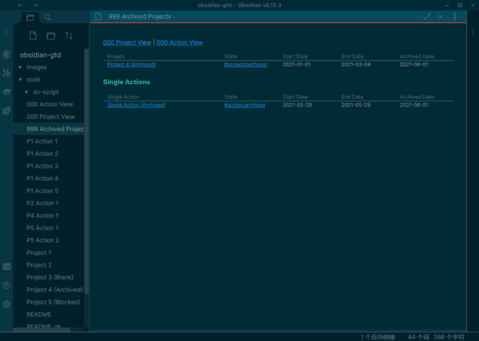
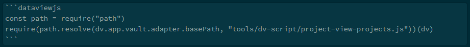

# Obsidian Project Management Starter Kit
> A thousand miles journey is started by taking the first step.

[中文教程](./README_zh.md)

Here is the workflow for me to manage schedule tasks in Obsidian. The [obsidian-dataview](https://blacksmithgu.github.io/obsidian-dataview/docs/intro) plugin is required to list projects/actions automatically.

**Project View**


* `N/A` means there is no action in this project.
* `Blocked` means there is no *Active* action in this project. Telling that you shoud put some actions into active state.

**Action View**


**A project**


**An action**


**Archived Projects**


## Features
- √ Project View: Show all projects in a view.
- √ Action Views: Show all actions in a view.
- √ Archive Projects and Actions: Making *Project View* and *Action Views* more focusable.
- √ Tag name customizable: If you don't like the tag below, you can rename them!
- √ Display the progress of action for an program
- √ Display progress of task for an action

First of all, this is **NOT** a fully implemented GTD system, but a project management system. It manages your projects, project-related actions (like "Tasks" in GTD), and simple actions (actions do not belong to any project.)

```
- Project A
	- Project-related Action 1
	- project-related Action 2
- Project B
	- Project-related Action 3
- Simple Action 1
- Simple Action 2
```

## A project is a markdown file
In this workflow, If an `.md` file with a `#project` tag in it, then it's a project. 

There are also some properties so call [Inline Fields](https://blacksmithgu.github.io/obsidian-dataview/docs/where-data-comes-from) that using in a project file. 

- `start_date::`：The date when this project has been started.
- `end_date::`: The date when this project is finished.
- `state::`: I use [Obsidian Nested tags](https://help.obsidian.md/Plugins/Tag+pane#Nested+tags) to manage the states of a project. The available tags are as follows:
	1. `#project/active`: when this project is active.
	2. `#project/archived`: when this project has been finished and It was no need to be display, I marked this tag to this project.

## A action is also a markdown file
Defferent from a task `- [ ]` in the `.md` file, an "action" is also an `.md` file, with a `#action` tag in it.

An action also contains some inline fields:

- `project::`: If an action contains this inline field, it's an project-related action. The value of this field *SHOULD* be an [Internal link](https://help.obsidian.md/How+to/Internal+link) to the project. If the value is not given, then this is a simple action.
- `due_date::`: The due date of this action.
- `start_date::`: The date when this action has been started.
- `end_date::`: The date when this action is finished.
- `priority::`: A > B > C, or 1 > 2 > 3.
- `state::`: Just like the `state` field in a project, all action states are as follows:
	1. `#action/active`: when this action is active, hard working to deal it.
	2. `#action/waiting`: when this action relies on other action or relies on somebody's response, I mark this action into this state.
	3. `#action/done`: when this action is finished, mark this action into this state, and update the `end_date`.
	4. `#action/canceled`: when this action has been finished.
	5. `#action/maybe`: Actions that you may do in somedays.
	6. `#action/archived`: when this action has been finished and It was no need to be display, I marked this tag to this action. I usually do this for the Single Actions.

## Priority
A > B > C > D ..., or 1 > 2 > 3 > 4 ... (using default sort method) is ok!

## About dataviewjs

I use `dataviewsjs` blocks instead of `dataview` blocks because I can write Javascript code inside a `dataviewsjs` block and it can do much complex work than Dataview Query Language. For example, I can join two table using JS, but the JOIN statement hasn't implemented in DQL yet.

I put all my JS code into `/tools/dv-script/` folder, and they are all `*.js` files. There are some advantages: 

1. I can use VSCode to write code (VSCode).
2. Better for code reusing.
3. Letting `dataviewsjs` block take up less space than writting all the raw code in the block. For example, to show the project view, I just need to write 2 line:
	

---
Thanks for the awesome plugin [obsidian-dataview](https://blacksmithgu.github.io/obsidian-dataview/docs/intro)!