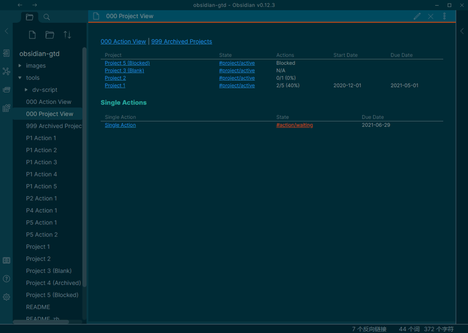
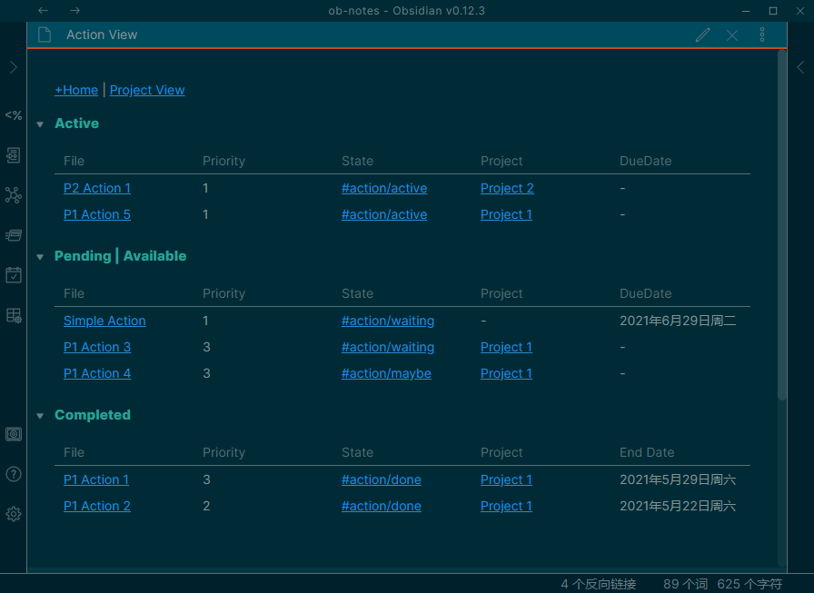
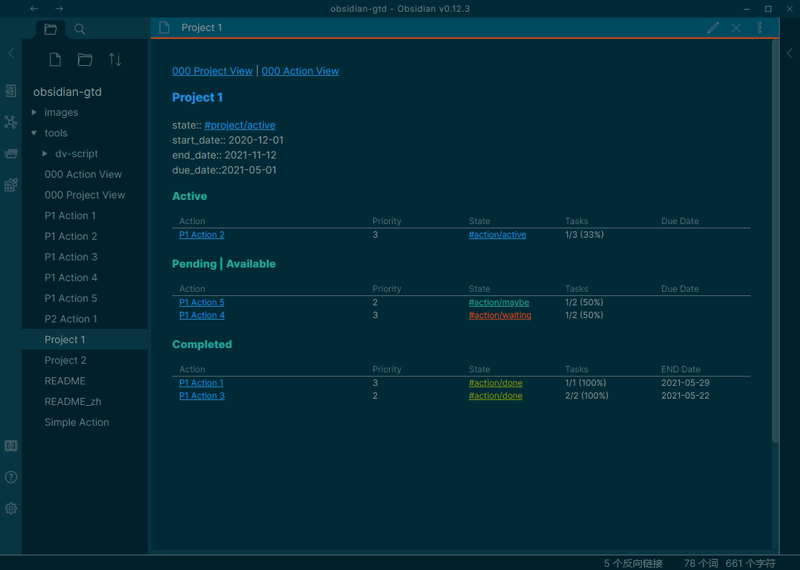
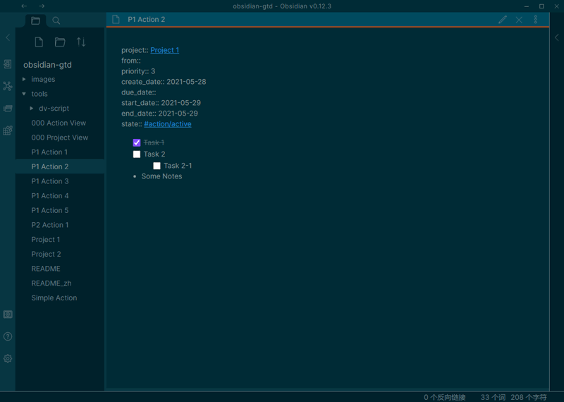

# Obsidian Project Management Starter Kit
> 再长的路，一步步也能走完，再短的路，不迈开双脚也无法到达。

[英文教程](./README.md)

这是我使用 Obsidian 来管理项目任务的工作流，使用了 [obsidian-dataview](https://blacksmithgu.github.io/obsidian-dataview/docs/intro) 插件来进行自动展示，还不是很完善，纯粹抛砖引玉吧！

**Project Viewer**


**Action Viewer**


**A project**


**An action**


首先，这并不是一个完整的 GTD 系统，目前最多算是个项目管理系统，它管理你的 Project、Project 下的 Action、以及项目无关的 Action。

```
- Project A
	- Project-related Action 1
	- project-related Action 2
- Project B
	- Project-related Action 3
- Simple Action 1
- Simple Action 2
```


## Project
Project 是为创造独特的产品、服务或成果而进行的体系化的工作，它有明确的目标（Goal）。例如，Project 可以是开发一个博客网站、一次自驾车旅行策划等。

在本系统中，如果某个 `.md` 文件中出现 `#project` 标签，就认为是一个 Project。Project 有它的生命归期，具体由以下行内字段（[Inline Fields](https://blacksmithgu.github.io/obsidian-dataview/docs/where-data-comes-from)）来表现：

- 开始时间 `start_date::`
- 结束时间 `end_date::`
- 项目状态 `state::`，我使用 Obsidian 的嵌套标签（[Obsidian Nested tags](https://help.obsidian.md/Plugins/Tag+pane#Nested+tags)）来管理项目状态，可选值有：
	1. 进行中 `#project/active`
	2. 已归档 `#project/archive`

## Action
由于 Markdown 中有 Task 这个概念，为了避免与它相混淆，我将 Project 细分后的行动定义为 Action。

在本系统中，如果某个 `.md` 文件中出现 `#action` 标签，就认为是一个 Action。Action 也可以有时间范围的约束，也有不同的活动状态，具体如下：

- 关联项目 `project::`，如果想将这个 action 关联到某个 project 中，就在这里加上那个 project 的内部链接（[Internal link](https://help.obsidian.md/How+to/Internal+link)）即可，如果这个字段没有值，那么这个 action 是一个项目无关的 action。
- 预计完成时间 `due_date::`
- 开始时间 `start_date::`
- 实际完成时间 `end_date::`
- 优先级 `priority::`，A > B > C，或者 1 > 2 > 3
- 活动状态 `state::`，类似项目状态，我同样定义了多个标签：
	1. 进行中 `#action/active`，很好理解，正在进行的 Action，需要完成；
	2. 等待中 `#action/waiting`，当 Action 被阻塞，例如需要等待他人回复后才能继续进行的，我就会设置这个状态；
	3. 已完成 `#action/done`，很好理解，Action 成功结束，就设置这个状态，同时更新 `end_date`；
	4. 已取消 `#action/canceled`，Action 没必要再进行下去，可以设置为这个状态；
	5. 将来、可能 `#action/maybe`，一些可选的，或者不紧急的 Action 可以设置为这个状态，一般不限定时间范围。

## Priority
本系统对优先级没有明确的定义，只有一个约定，就是优先越高的，其 ASCII 码越靠前，如 A > B > C，1 > 2 > 3。

---
Thanks for the awesome plugin [obsidian-dataview](https://blacksmithgu.github.io/obsidian-dataview/docs/intro)!